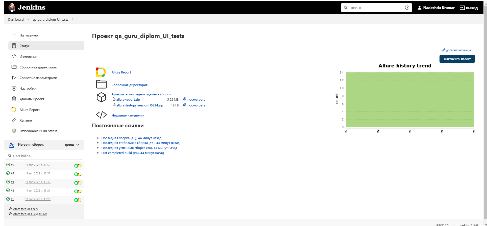
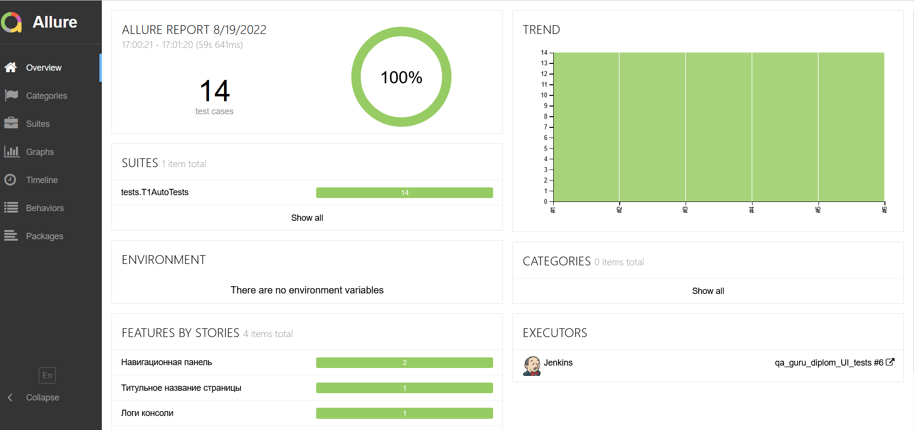
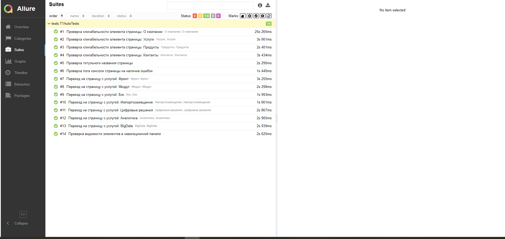
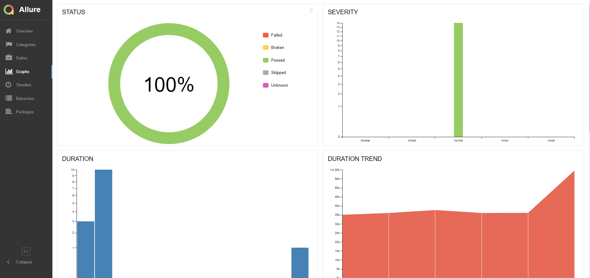
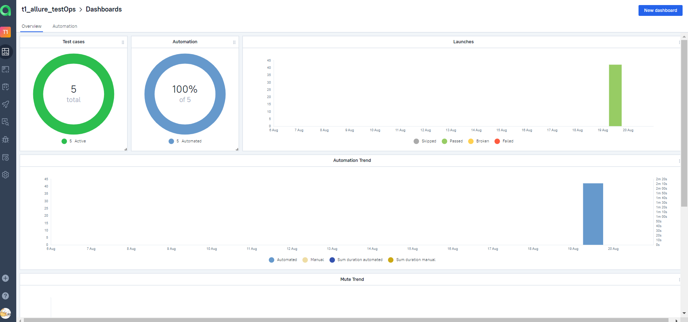
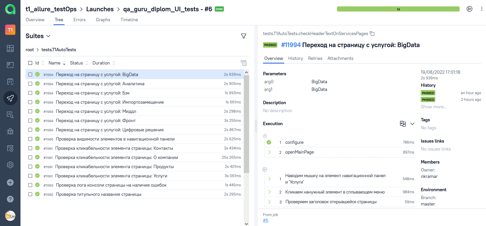
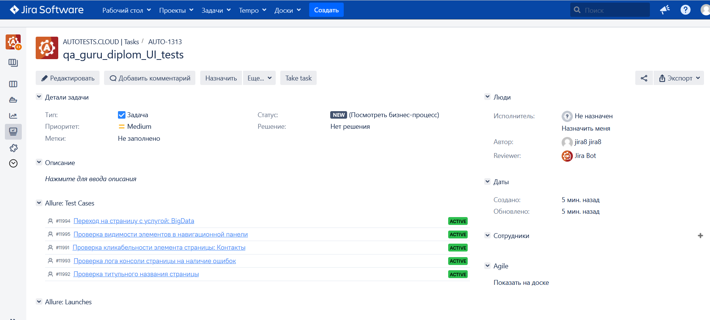
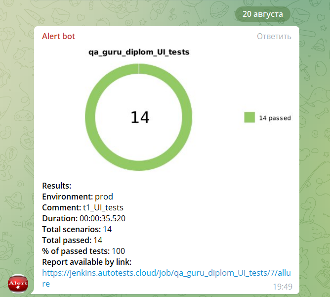

<h2 align="center"> Проект по автоматизации тестирования для компании <a target="_blank" href="https://www.t1-consulting.ru">Т1 Консалтинг</a> </h2>

<p align="center">

</p>

<a name="cодержание"></a>
# :green_book: *Содержание*

+ [Технологии и инструменты](#Technology)
+ [Примеры автоматизированных тест кейсов](#TestCases)
+ [Запуск тестов в Jenkins](#Jenkins)
+ [Команды для запуска из терминала](#SystemProperty)
+ [Отчет о результатах тестирования в Allure Report](#AllureReport)
+ [Интеграция с Allure TestOps](#AllureTestOps)
+ [Интеграция с Jira](#Jira)
+ [Уведомление в Telegram при помощи Alert bot](#Telegram)
+ [Примеры видео выполнения тестов на Selenoid](#Selenoid)


<h1 align="left">
<a name="Technology"><i>Технологии и инструменты</i></a>
</h1>

<p align="center">  
<a href="https://www.jetbrains.com/idea/"></a>  
<a href="https://www.java.com/"></a>  
<a href="https://github.com/"></a>  
<a href="https://junit.org/junit5/"></a>  
<a href="https://gradle.org/"></a>  
<a href="https://selenide.org/"></a>  
<a href="https://aerokube.com/selenoid/"></a>  
<a href="https://github.com/allure-framework/allure2"></a> 
<a href="https://qameta.io/"></a>   
<a href="https://www.jenkins.io/"></a>  
<a href="https://www.atlassian.com/ru/software/jira/"></a>  
</p>


<h1 align="left">
<a name="TestCases"><i>Примеры автоматизированных тест кейсов</i></a>
</h1>

- :white_check_mark: Проверка названия страницы
- :white_check_mark: Проверка видимости текстовых элементов в навигационной панели страницы
- :white_check_mark: Проверка лога консоли страницы на наличие ошибок
- :white_check_mark: Проверка кликабельности элементов навигационной панели
- :white_check_mark: Проверка навигации по страницам с предоставляемыми услугами


<h1 align="left">
  <a name="Jenkins"><i>Запуск тестов в Jenkins</i></a>
</h1>

<a target="_blank" href="https://jenkins.autotests.cloud/job/qa_guru_diplom_UI_tests/">**Сборка в Jenkins**</a>
<p align="center">  
<a href="https://jenkins.autotests.cloud/job/qa_guru_diplom_Mobile_tests/"></a>  
</p>


# *Параметры сборки в Jenkins:*

- *BROWSER (браузер, по умолчанию chrome)*
- *BROWSER_VERSION (версия браузера, по умолчанию 100.0)*
- *BROWSER_SIZE (размер окна браузера, по умолчанию 1920x1080)*
- *HOST (адрес удаленного сервера Selenoid с логином и паролем)*

<h1 align="left">
<a name="SystemProperty"><i>Команды для запуска из терминала</i></a>
</h1>

***Локальный запуск:***
```bash  
gradle clean test
-Dhost=local
```

***Удалённый запуск через Jenkins:***
```bash  
clean test
-Dbrowser=${BROWSER}
-DbrowserSize=${SIZE}
-Dhost=remote
```

<h1 align="left">
  <a name="AllureReport"><i>Отчет в Allure Report</i></a>
</h1>

<a target="_blank" href="https://jenkins.autotests.cloud/job/qa_guru_diplom_UI_tests">**Отчёт в Jenkins**</a>
<p align="center"> 


### *Основная страница отчёта*

<p align="center">  
  
</p>  

### *Тест кейсы*

<p align="center">  
  
</p>

### *Графики*

  <p align="center">  
  
</p>


<h1 align="left">
 <a name="AllureTestOps"><i>Интеграция с Allure TestOps</i></a>
</h1>

<a target="_blank" href="https://allure.autotests.cloud/launch/15392/tree?treeId=0">**Проект в TestOps**</a>
<p align="center">  


## *Allure TestOps Dashboard*

<p align="center">  
  
</p> 

## *Тест кейсы*

<p align="center">  
  
</p>

<h1 align="left">
 <a name="Jira"><i>Интеграция с Jira</i></a>
</h1>

<a target="_blank" href="https://jira.autotests.cloud/browse/AUTO-1313">**Тикет в Jira**</a>
<p align="center">  


<p align="center">  
  
</p>

<h1 align="left">
 <a name="Telegram"><i>Уведомление в Telegram при помощи Alert bot</i></a>
</h1>

<p align="center">  
  
</p>


<h1 align="left">
 <a name="Selenoid"><i>Примеры видео выполнения тестов на Selenoid</i></a>
</h1>

<p align="center"> 
   
</p>

[К содержанию ⬆](#содержание)
